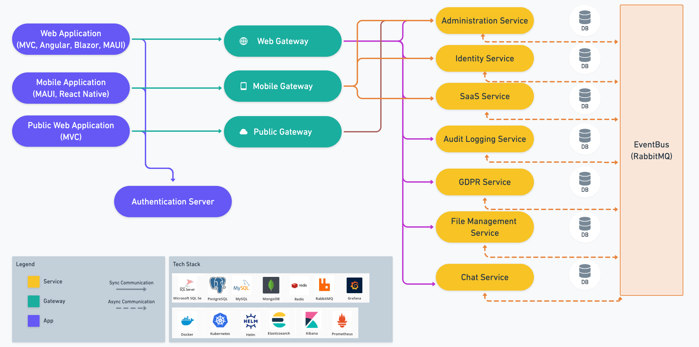

# Microservice Solution: Overview

````json
//[doc-nav]
{
  "Next": {
    "Name": "Solution Structure",
    "Path": "solution-templates/microservice/solution-structure"
  }
}
````

In this document, you will learn what the Microservice solution template offers to you.

## The Big Picture


*Figure: Overall Diagram of the Solution (not all associations are shown, for the sake of simplicity)*

## Pre-Installed Libraries & Services

All the following **libraries and services** are **pre-installed** and **configured** for both of **development** and **production** environments. After creating your solution, you can **change** to **remove** most of them.

* **[Autofac](https://autofac.org/)** for [Dependency Injection](../../framework/fundamentals/dependency-injection.md)
* **[Serilog](https://serilog.net/)** with File, Console and Elasticsearch [logging](../../framework/fundamentals/logging.md) providers
* **[Prometheus](https://prometheus.io/)** for collecting metrics
* **[Grafana](https://grafana.com/)** to visualize the collected metrics
* **[Redis](https://redis.io/)** for [distributed caching](../../framework/fundamentals/caching.md) and [distributed locking](../../framework/infrastructure/distributed-locking.md)
* **[Swagger](https://swagger.io/)** to explore and test HTTP APIs
* **[RabbitMQ](https://www.rabbitmq.com/)** as the [distributed event bus](../../framework/infrastructure/event-bus/distributed/index.md)
* **[YARP](https://microsoft.github.io/reverse-proxy/)** to implement the API Gateways
* **[OpenIddict](https://github.com/openiddict/openiddict-core)** as the in-house authentication server.

## Pre-Configured Features

The following features are built and pre-configured for you in the solution.

* **Authentication** is fully configured based on best practices;
  * **JWT Bearer Authentication** for microservices and applications.
  * **OpenId Connect Authentication**, if you have selected the MVC UI.
  * **Authorization code flow** is implemented, if you have selected a SPA UI (Angular or Blazor WASM).
  * Other flows (resource owner password, client credentials...) are easy to use when you need them.
* **[Permission](../../framework/fundamentals/authorization.md)** (authorization), **[setting](../../framework/infrastructure/settings.md)**, **[feature](../../framework/infrastructure/features.md)** and the **[localization](../../framework/fundamentals/localization.md)** management systems are pre-configured and ready to use.
* **[Background job system](../../framework/infrastructure/background-jobs/index.md)** with [RabbitMQ integrated](../../framework/infrastructure/background-jobs/rabbitmq.md).
* **[BLOB storge](../../framework/infrastructure/blob-storing/index.md)** system is installed with the [database provider](../../framework/infrastructure/blob-storing/database.md) and a separate database.
* **On-the-fly database migration** system (services automatically migrated their database schema when you deploy a new version)
* Infrastructure dependencies are configured via **[docker-compose](https://docs.docker.com/compose/)** for running the solution in local environment.
* **[Helm](https://helm.sh/)** charts are included to deploy the solution to **[Kubernetes](https://kubernetes.io/)**.
* **[Swagger](https://swagger.io/)** authentication is configured to test the authorized HTTP APIs.
* Configured the **[Inbox & Outbox patterns](../../framework/infrastructure/event-bus/distributed/index.md#outbox--inbox-for-transactional-events)** for [distributed event bus](../../framework/infrastructure/event-bus/distributed/index.md).

## Fundamental Modules

The following modules are pre-installed and configured for the solution:

* **[Account](../../modules/account.md)** to authenticate users (login, register, two factor auth, etc)
* **[Identity](../../modules/identity.md)** to manage roles and users
* **[OpenIddict](../../modules/openiddict.md)** (the core part) to implement the OAuth authentication flows

In addition these, [Feature Management](../../modules/feature-management.md), [Permission Management](../../modules/permission-management.md) and [Setting Management](../../modules/setting-management.md) modules are pre-installed as they are the fundamental feature modules of the ABP.

## Optional Modules

The following modules are optionally included in the solution, so you can select the ones you need:

* **[Audit Logging](../../modules/audit-logging.md)** (with its own microservice)
* **[Chat](../../modules/chat.md)** (with its own microservice)
* **[File Management](../../modules/file-management.md)** (with its own microservice)
* **[GDPR](../../modules/gdpr.md)** (with its own microservice)
* **[Language Management](../../modules/language-management.md)**
* **[OpenIddict (Management UI)](../../modules/openiddict.md)**
* **[SaaS](../../modules/saas.md)** (Multi-Tenancy) (with its own microservice)
* **[Text Template Management](../../modules/text-template-management.md)**

## UI Theme

The **[LeptonX theme](https://leptontheme.com/)** is pre-configured for the solution. You can select one of the color palettes (System, Light or Dark) as default, while the end-user dynamically change it on the fly.

## Other Options

Microservice startup template asks for some preferences while creating your solution.

### Database Providers

There are two database provider options are provided on a new microservice solution creation:

* **[Entity Framework Core](../../framework/data/entity-framework-core/index.md)** with SQL Server, MySQL and PostgreSQL DBMS options. You can [switch to anther DBMS](../../framework/data/entity-framework-core/other-dbms.md) manually after creating your solution.
* **[MongoDB](../../framework/data/mongodb/index.md)**

### UI Frameworks

The solution comes with a main web application with the following UI Framework options:

* **None** (doesn't include a web application to the solution)
* **Angular**
* **MVC / Razor Pages UI**
* **Blazor WebAssembly**
* **Blazor Server**
* **MAUI with Blazor (Hybrid)**

### The Mobile Application

If you prefer, the solution includes a mobile application with its dedicated API Gateway. The mobile application is fully integrated to the system, implements authentication (login) and other ABP features, and includes a few screens that you can use and take as example. The following options are available:

* **None** (doesn't include a mobile application to the solution)
* **MAUI**
* **React Native**

### Multi-Tenancy & SaaS Module

The **[SaaS module](../../modules/saas.md)** is included as an option. When you select it, the **[multi-tenancy](../../framework/architecture/multi-tenancy/index.md)** system is automatically configured. Otherwise, the system will not include any multi-tenancy overhead.

## See Also

* [Quick Start: Creating a Microservice Solution with ABP Studio](../../get-started/microservice.md)
